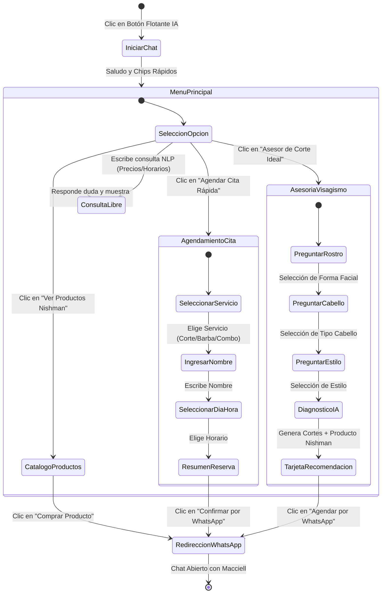
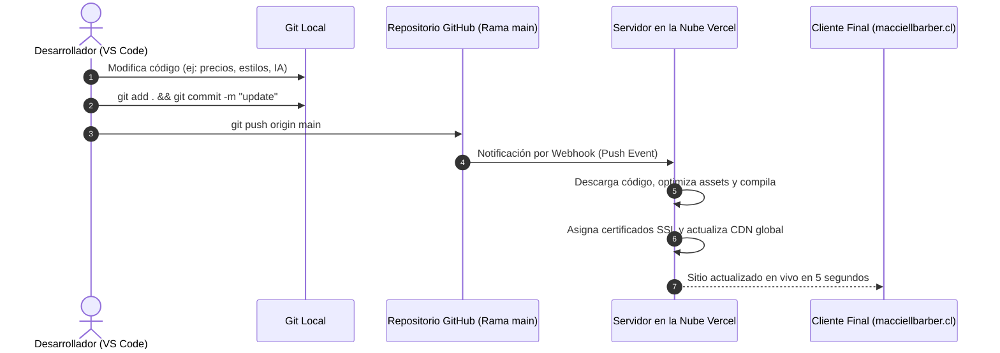

# Documentación Técnica del Proyecto: MacciellBarber Web & Macciell AI

**Cliente:** Macciell | Barbero Profesional  
**Ubicación:** Sindempart, Coquimbo, Chile  
**Desarrollador:** Joaquin E. Araya L.  
**Versión:** 2.0.0 (Producción)  
**Dominio Oficial:** `macciellbarber.cl` / `macciellbarber.vercel.app`

---

## 1. Resumen Ejecutivo y Alcance

El proyecto **MacciellBarber Web** es una plataforma web comercial de alta gama (*Luxury Dark & Gold*) diseñada para una barbería profesional de autor. Su propósito es posicionar la marca de Macciell, exhibir sus especialidades y galería de trabajos, comercializar productos profesionales de peinado y afeitado (Nishman), y automatizar la captación y asesoría de clientes mediante un **Agente de Inteligencia Artificial ("Macciell AI")** conectado a WhatsApp.

---

## 2. Arquitectura de la Solución y Stack Tecnológico

```mermaid
graph TD
    User([Cliente / Visitante]) -->|Navega en Desktop o Móvil| Frontend[Frontend Web App: HTML5 + CSS3 + ES6]
    Frontend --> UI_Components[Diseño Luxury: Glassmorphism / Parallax / Carousels / Lightbox]
    Frontend --> AI_Agent[Módulo Macciell AI: Asesor de Imagen & NLP]
    
    AI_Agent --> Engine_Visagismo[Motor de Visagismo y Morfología Facial]
    AI_Agent --> Engine_Booking[Concierge de Pre-Agendamiento]
    AI_Agent --> Engine_Catalog[Motor de Recomendación de Productos]
    
    Engine_Visagismo --> WA_Gen[Generador de Enlaces Dinámicos de WhatsApp]
    Engine_Booking --> WA_Gen
    Engine_Catalog --> WA_Gen
    
    WA_Gen --> WhatsApp[WhatsApp Business de Macciell (+56 9 9615 5254)]
    
    Repo[(GitHub Repo: main)] -->|Webhook Automático CI/CD| Vercel[Vercel Edge Cloud Network]
    Vercel -->|DNS / SSL HTTPS| Domain[macciellbarber.cl / NIC Chile]
```

### Tecnologías Utilizadas:
* **Estructura:** HTML5 Semántico con estándares de accesibilidad (WAI-ARIA) y SEO optimizado.
* **Estilos:** Vanilla CSS3 con sistema de variables de diseño (*Luxury Dark & Gold*), Grid Layout, Flexbox, Glassmorphism, animaciones aceleradas por GPU y diseño responsive Mobile-First.
* **Lógica & Dinamismo:** JavaScript Vanilla (ES6+ modular) para efectos de scroll reveal, parallax, carruseles táctiles con soporte swipe, lightbox interactivo y el Agente de IA.
* **Infraestructura & CI/CD:** GitHub + Vercel Cloud Platform con despliegues automáticos ante cada `git push` y CDN global con certificado SSL (HTTPS).

---

## 3. Especificación de Casos de Uso (Use Cases)

### CU-01: Asesoría de Imagen y Visagismo con el Agente de IA
* **Actor:** Cliente / Visitante.
* **Propósito:** Obtener una recomendación personalizada de corte de cabello según su morfología facial y estilo personal.
* **Precondición:** El usuario accede a la web desde cualquier dispositivo.
* **Flujo Principal:**
  1. El usuario hace clic en el botón flotante del **Agente de IA** (o en el chip *"💈 Asesor de Corte Ideal"*).
  2. El agente saluda y solicita la forma del rostro (*Ovalado, Cuadrado, Redondo, Alargado*).
  3. El usuario selecciona la opción que mejor describe su fisonomía.
  4. El agente pregunta por el tipo de cabello (*Lacio, Ondulado, Rizado, Fino*).
  5. El usuario selecciona su tipo de cabello y la vibra o estilo deseado (*Urbano/Fade, Ejecutivo/Clásico, Barba Completa*).
  6. El agente procesa las respuestas y emite un diagnóstico estético detallado con los cortes específicos de Macciell sugeridos, producto recomendado de peinado y un botón directo de WhatsApp.
  7. El usuario hace clic en el botón y es redirigido a WhatsApp con el mensaje pre-redactado listo para enviar.

---

### CU-02: Agendamiento Rápido Asistido por IA
* **Actor:** Cliente.
* **Propósito:** Coordinar una cita de barbería sin fricción ni formularios complejos.
* **Flujo Principal:**
  1. El usuario selecciona la opción *"📅 Agendar Cita Rápida"* en el chat del agente.
  2. El agente despliega los servicios disponibles con sus precios actualizados.
  3. El usuario escoge el servicio deseado.
  4. El agente solicita el nombre del cliente.
  5. El usuario ingresa su nombre en el input de texto.
  6. El agente pregunta por el día y bloque horario preferido (*Mañana, Tarde, Tarde/Noche*).
  7. El agente genera una tarjeta de confirmación de reserva con el resumen de la cita.
  8. El usuario presiona *"Confirmar y Enviar por WhatsApp"*, abriendo el chat oficial de Macciell con toda la ficha de la cita completa.

---

### CU-03: Exploración del Catálogo y Compra de Productos Nishman
* **Actor:** Cliente.
* **Propósito:** Ver la línea de lociones aftershave y ceras moldeadoras, y solicitar la compra.
* **Flujo Principal:**
  1. El usuario ingresa a `productos.html` o solicita *"Ver productos"* en el chat de IA.
  2. El usuario navega por los carruseles interactivos con botones de navegación, indicadores o gestos táctiles (swipe en celular).
  3. El usuario revisa características, aromas y precios de los productos.
  4. Hace clic en el botón *"Comprar 💵"*, el cual abre WhatsApp con el nombre del producto seleccionado pre-cargado.

---

### CU-04: Visualización de Trabajos en Galería (Lightbox)
* **Actor:** Visitante.
* **Propósito:** Evaluar la calidad visual de los cortes y detalles de Macciell en alta resolución.
* **Flujo Principal:**
  1. El usuario hace clic en cualquier fotografía de la sección `#galeria`.
  2. Se abre un modal Lightbox oscuro con animación de escalado y fondo desenfocado.
  3. El usuario puede navegar con las flechas laterales, gestos táctiles o las teclas `←` / `→` / `Escape`.
  4. Puede cerrar la vista haciendo clic en la `X` o fuera de la imagen.

---

## 4. Diagramas de Actividades (Activity Diagrams)

### Diagrama 1: Flujo Conversacional del Agente de IA Macciell



---

### Diagrama 2: Flujo de Despliegue y Ciclo de Integración Continua (CI/CD)



---

## 5. Estructura de Archivos del Proyecto

```text
maccielbarber-web/
├── assets/                          # Recursos gráficos y multimedia
│   ├── favicon.svg                  # Favicon vectorial con icono de barbería
│   ├── barber_profile.jpg           # Imagen principal del Hero
│   ├── gallery_1.jpg ... 8.jpg      # Imágenes de la galería y trabajos
│   ├── service_corte.png ...        # Imágenes de tarjetas de servicios
│   └── product_*.png                # Imágenes de productos Nishman
├── docs/                            # Documentación técnica y diagramas
│   └── DOCUMENTACION_TECNICA.md     # Este documento técnico completo
├── ai-agent.js                      # Motor del Agente de Inteligencia Artificial
├── app.js                           # Lógica de carruseles, lightbox, menú móvil y animaciones
├── index.html                       # Landing Page principal
├── productos.html                   # Catálogo exclusivo de productos Nishman
├── style.css                        # Hoja de estilos globales y del Agente de IA
└── README.md                        # Presentación principal del repositorio
```

---

## 6. Guía de Mantenimiento para el Cliente y Desarrollador

### Actualización de Precios y Servicios:
* Para modificar los precios y servicios que recomienda el Agente de IA, edita el objeto `BARBER_CONFIG.services` dentro de [ai-agent.js](file:///c:/Users/Joaquin/OneDrive/Escritorio/maccielbarber-web/ai-agent.js).
* Para modificar los precios mostrados en la landing page, edita las tarjetas de `.service-card` en [index.html](file:///c:/Users/Joaquin/OneDrive/Escritorio/maccielbarber-web/index.html).

### Actualización de Productos Nishman:
* Los productos mostrados en el chat de IA se editan en `BARBER_CONFIG.products` en [ai-agent.js](file:///c:/Users/Joaquin/OneDrive/Escritorio/maccielbarber-web/ai-agent.js).
* El catálogo visual completo se gestiona dentro de las tarjetas `.product-carousel-item` en [productos.html](file:///c:/Users/Joaquin/OneDrive/Escritorio/maccielbarber-web/productos.html).

### Configuración de Dominio Personalizado (.CL en NIC Chile):
1. Adquiere el dominio en [nic.cl](https://www.nic.cl).
2. En el panel del proyecto en **Vercel** (`Settings > Domains`), agrega `macciellbarber.cl` y `www.macciellbarber.cl`.
3. Ingresa a tu panel de NIC Chile y copia los registros DNS (A y CNAME) indicados por Vercel.
4. La propagación DNS tarda habitualmente entre 15 minutos y 2 horas.

---
*Documentación generada y respaldada para Macciell Barber.*
